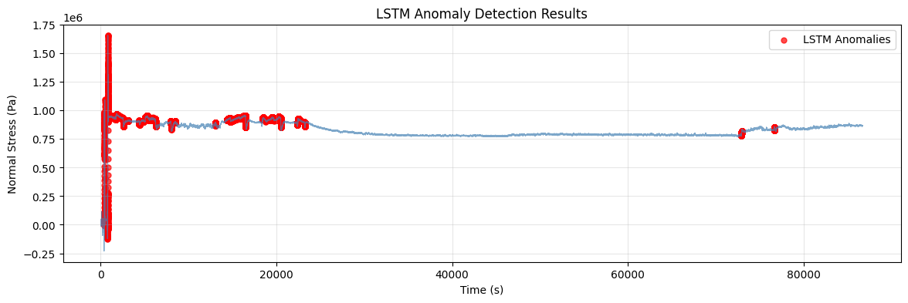

# Polymer Stress Anomaly Detection

Deep learning-based anomaly detection system for polymer stretch-relaxation stress data using LSTM Autoencoders.

## Overview

This project implements a dual-method approach to detect anomalies in polymer stress-time series data:

1. **IQR-Based Outlier Detection** - Statistical baseline for identifying extreme values
2. **LSTM Autoencoder** - Deep learning model that learns temporal patterns to detect damage/recovery signatures

## Features

- 🚀 GPU-optimized for Google Colab (T4 GPU)
- 📊 Dual anomaly detection methods
- 📈 Comprehensive visualization of results
- 💾 Export results to CSV
- 🔧 Configurable hyperparameters
- 🎯 Reproducible results with fixed random seeds

## Performance & Validation
On datasets with minimal environmental interference, the LSTM autoencoder proves to be a powerful tool. It successfully distinguishes between the initial damage, the normal relaxation process, and the final recovery signatures with high specificity, validating the approach for material characterization.

## Methodology
### 1. IQR-Based Outlier Detection
Statistical baseline method using the Interquartile Range (IQR) to identify extreme stress values that fall outside typical operational bounds.
### 2. LSTM Autoencoder Architecture
Deep learning approach that learns temporal patterns in normal polymer behavior. The autoencoder is trained to reconstruct normal stress sequences; high reconstruction errors indicate anomalous behavior such as material damage or unexpected recovery patterns.

#### Architecture:
Encoder:  LSTM(128) → LSTM(64) → LSTM(32)
Latent:   RepeatVector(timesteps)
Decoder:  LSTM(32) → LSTM(64) → LSTM(128) → TimeDistributed(Dense(1))

## Requirements

```
numpy
pandas
matplotlib
scikit-learn
tensorflow>=2.0
```

## Installation

### For Google Colab (Recommended)
No installation needed! Just upload the notebook and run.

### For Local Use
```bash
pip install numpy pandas matplotlib scikit-learn tensorflow
```

## Usage

### Google Colab (Recommended)

1. Open Google Colab: https://colab.research.google.com
2. Upload `polymer_stress_anomaly_detection_colab.py`
3. Set Runtime → Change runtime type → **GPU** (T4 preferred)
4. Run all cells
5. Upload your CSV file when prompted
6. Download results when complete

### CSV File Format

Your CSV should contain these columns:
- `Time (s)` - Time measurements
- `Normal Stress (Pa)` - Stress measurements

Example:
```csv
Time (s),Normal Stress (Pa)
0.0,1234.56
0.1,1245.67
...
```

## Configuration

Key parameters you can adjust in the code:

```python
seq_len = 200              # Sequence length for LSTM
stride = 20                # Stride for sliding window
batch_size = 64            # Training batch size
epochs = 100               # Maximum training epochs
threshold_pct = 95         # Percentile threshold for anomalies
iqr_k = 1.5               # IQR multiplier for outlier detection
```

## Model Training
The LSTM autoencoder is trained using:
- Loss Function: Mean Squared Error (MSE)
- Optimizer: Adam
- Early Stopping: Patience of 8 epochs on validation loss
- Data Split: 80% training, 20% validation
- Regularization: Dropout (0.2) on LSTM layers

## Output

The script generates:

1. **Visualizations:**
   - IQR outlier detection plot
   - Training history (loss curves)
   - LSTM anomaly detection results

2. **CSV Export:**
   - Original data with anomaly flags
   - Columns: `time`, `stress`, `is_iqr_outlier`, `is_anomaly_lstm`


## How It Works

1. **Data Preprocessing:** Remove IQR outliers and standardize
2. **Sequence Creation:** Generate overlapping windows of stress data
3. **Model Training:** LSTM autoencoder learns normal patterns
4. **Anomaly Detection:** Flag sequences with high reconstruction error
5. **Results:** Visualize and export detected anomalies

## Example Results



*Red points indicate detected anomalies in polymer stress behavior*

## Citation

If you use this code in your research, please cite:

```bibtex
@software{polymer_stress_anomaly,
  title={Polymer Stress Anomaly Detection},
  author={Your Name},
  year={2025},
  url={https://github.com/yourusername/polymer-stress-anomaly-detection}
}
```

## License

MIT License - see LICENSE file for details

## Contributing

Contributions welcome! Please open an issue or submit a pull request.

## Acknowledgments

- Built with TensorFlow and Keras
- Optimized for Google Colab GPU runtime
- Inspired by autoencoder-based anomaly detection methods
